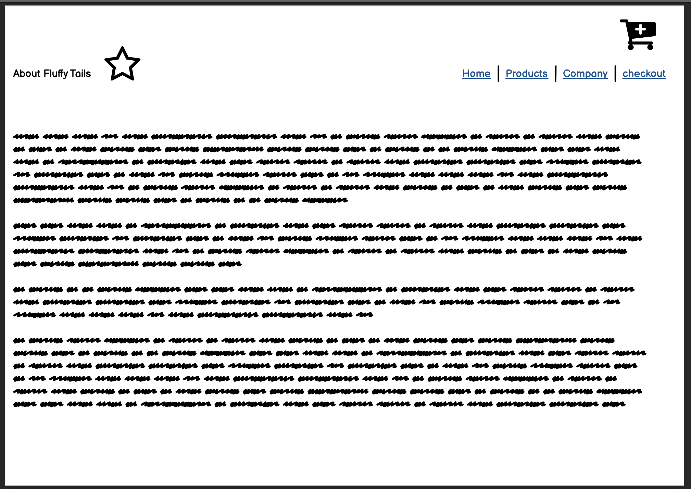

# README-Ruby on Rails Marketplace Application

## [Link to Repository](https://github.com/jobitoalv/FluffyTals2)
## [Link to Heroku](https://jobitoalv.herokuapp.com/)
## [Link to Teroll](https://trello.com/b/Pdd09J2E/fluffytales)

### **Admin Credentials**

#### Testing accounts

| #   | Account Type | Email          | Password  |
| --- | ------------ | -------------- | --------- |
| 1   | Admin        | admin@admin.com| 123456    |
| 2   | User         | test@test.com  | 123456    |
|  |              |                |           |


### Installation

---

1: Clone to this repository through git or download as a zip file

2: Install Progresql as this app uses Progresql for Database

3: Change into the directory and run the following command in terminal:
(Make sure Ruby is the at least version 3.0.0 and Rails on 6.1.4)
```
yarn install
```

```
bundle install
```

4: Progesql is on and run the following command in order:

```
rails db:create

rails db:migrate

rails db:seed
```

5: Now that you have done all the above steps, run the following command to start the application:

```
rails s
```

- These command will start the local server on your computer, just enter the address below on your brower:

```
http://localhost:3000/
```

## About the Fluffytales2
____________

Let’s talk abit about the project and the problems we are trying to solve. If you’re a-pet lover is not hard to understand that animals just like us humans have a lot of different skin conditions, such as itchy skin or dry skin with hot spots etc. they also require good Quality products not just the ones you can find in the big two pet stores . And trying to find good products online can also be overwhelming with different websites not being able to verify if the comments are true or not , my idea in creating this app is being able to build a community where all pet lovers will be able to share and listed what products they think is good and recommend to each other, and being a members online website we will be able to manager who is posting what , with a small fee to join we will attract REAL people with the intention to being able to help, not just anyone . 

## Purpose of Fluffytales2 
__________
* Memeber service, create a safe community for pet lovers
* One stop shop for good quality products that actually works
* Allow memebers to find the best product and real feedback from other memeber

## Functionality / Features
_________

* Users must sign up and sign in in order to use the application, when signing in, sign out button will appear and sign button will disappear and vice versa with when signing out
* Standard users are restricted with edit and delete functions
* Once users sign up, they can start uploading their posts, services including a photo, name, description, price and other details. 
* Admin users can have the access to edit, delete posts
* Users can edit their profile, change passwords and details
* Users can pay through the app using Stripe payment gateway

## Future implementation Fluffytales 2.1
_____
* Live Chat popup messenger
* Scoring System
* Members payment system
* Apple pay 

## Site map.


### **Wireframes**
Home Page Desktop:

Member Login Page:

Member Signin Page:

Member Listing Page:

Member Upload Product Page:

All Products Page:

*About Us Page:*

Confirmation Page:


This application follow the mobile first approach. The wireframes will consist of a mobile version then a desktop version. All other formats have been included in the road map but unfortunately I didn`t have time to add the page "about us" on the final project.

Home Page Mobile:

Member Login Page Mobile:


## **Target Audience**
_______

The target audience for this application is anyone who loves their pets and want good Quality skin care for pets and for those who wants to share their experiences with others and for those who are will to pay a fee to help the pet Community with real and honest reviews.

# ERD tables
First version of the ERD:


Reason to finalized ERD tables:
 1. Simplified the whole ERD making it easy to read.
 2. Adding image_id.

Finalize version of the ERD:


# Third party services
1. Fontawesome - to add icons
2. Bootstrap 5 - to style and customize Front-End interaction
3. Devise Gem - to create user accounts with authencation
4. Ransack Gem - to implement search functions
5. Heroku - a cloud platfrom allow developers to deploy their application supporting a wide range of languages including ruby and PostgreSQL server
6. Stripe - this is an online payment gateway that allows users to make payment online with low transaction fees
7. Ultrahook gem - using a public webhook enpoint to track realtime information from Stripe. 

### **Explain the Rails Models**

 1. Rails uses models to access data from the database (in this case the postgres database) and hand these to the controller. Common rails mantra is 'fat model, skinny controller', which indicates that the model handles most of the work grabbing and sorting some data to hand over to the controller. Here are the Models used for this project and a short description of their tasks.

2. When an user create a post and service, the create method in post and service controllers is checking and assign current user with the post which has just been created. 

3. In the views, all the buttons are display by using link_to syntax and path using rails routes. Therefore, relevant contents are to be rendered.


# Database models and relationships
## User 
- has many orders
- has one user_name

## User_name
- belongs to user

## User_contact
- belong to user_id
- has one user_address

## Product
- belong to order
- has one image_id

# **Database Schema Design**


# Task Planning 
I`ve used Trello throughout the entire project to manage all the task requirements, I’ve created a few tables to track all the tasks that require attention. 

  1. To Do List
  2. Doing List
  3. Done List
  4. Debugging List


# **Screenshots of the App**

Home Page


Sign Up:


Login Page:


Home footer:


Product List:


Search Bar:


Buy Button:


Payment Stripe Page:


Comfirmation:


Show More Page:


## Author

Job Alvarez 2021